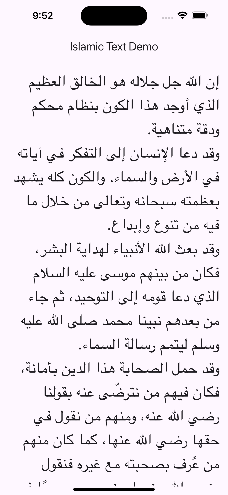
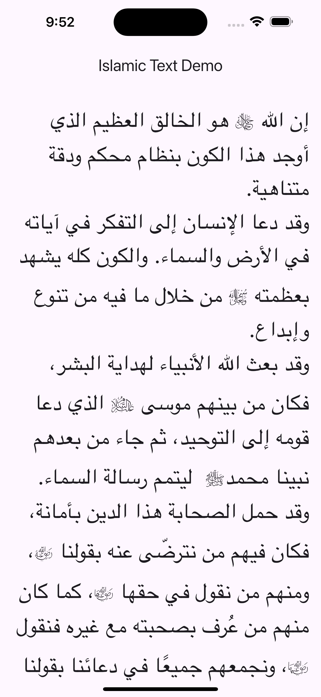

# Islamic Text

A Flutter widget to render Islamic phrases with compact ligatures and custom font.  
This package replaces common phrases like "صلى الله عليه وسلم" with symbols such as "ﷺ" and paints them in a dedicated font. It is designed to be **safe, performant, and extensible** for future glyph rendering.

---

## Font Setup (Required)

This package uses a custom font called **IslamicPhrases**.  

Add the following to your **host app** `pubspec.yaml`:

```yaml
flutter:
  fonts:
    - family: IslamicPhrases
      fonts:
        - asset: packages/islamic_text/fonts/islamic_phrases.ttf
```

> ⚠️ Without this, the `IslamicText` widget will fallback to normal text or throw an error if fallback is disabled.

---

## Features

- Replace Islamic phrases with compact ligatures
- Render ligatures using a custom font
- Configurable vertical offset for perfect alignment
- Support for multi-line text and text styling
- Safe fallback if the font is missing (Web or misconfigured apps)
- Future-ready: can extend to glyph rendering and complex shaping
- Fully reversible text encoding/decoding for serialization or testing


## Preview

| Without IslamicText | With IslamicText |
|-------------------|-----------------|
|  |  |

---

## Getting Started

### Prerequisites

- Flutter >= 3.7.0
- Dart >= 3.0.0
- Add the custom font as shown above

### Installation

Add to your `pubspec.yaml`:

```yaml
dependencies:
  islamic_text: ^1.0.0
```

Then run:

```bash
flutter pub get
```

---

## Usage

### Simple Example

```dart
import 'package:flutter/material.dart';
import 'package:islamic_text/islamic_text.dart';

class MyHomePage extends StatelessWidget {
  const MyHomePage({super.key});

  @override
  Widget build(BuildContext context) {
    return Scaffold(
      appBar: AppBar(title: const Text('IslamicText Example')),
      body: const Padding(
        padding: EdgeInsets.all(16),
        child: IslamicText(
          text: 'محمد صلى الله عليه وسلم',
          islamicVerticalOffset: -0.05,
        ),
      ),
    );
  }
}
```

### Custom Styles

```dart
IslamicText(
  text: 'محمد صلى الله عليه وسلم',
  normalTextStyle: TextStyle(fontSize: 18, color: Colors.black87),
  islamicTextStyle: TextStyle(fontSize: 20, color: Colors.green),
  islamicVerticalOffset: 0.0,
  textAlign: TextAlign.center,
)
```

> The `islamicVerticalOffset` helps align the ligatures correctly with surrounding text.

---

## Advanced Usage

- Encode/decode text programmatically:

```dart
import 'package:islamic_text/src/ligature_replacer.dart';

final replacer = LigatureReplacer();
final encoded = replacer.encode('محمد صلى الله عليه وسلم');
final decoded = replacer.decode(encoded);
```

- Handle fallback if font is not registered:

```dart
const useFallback = true;
final textWidget = IslamicText(
  text: 'محمد صلى الله عليه وسلم',
  islamicVerticalOffset: 0.0,
  enableFallback: useFallback,
);
```

---

## Example App

Check the `/example` folder for a working Flutter application that demonstrates:

- Ligature replacement
- Custom styling
- Long multi-line text
- Font fallback

Run the example:

```bash
cd example
flutter run
```

---

## Additional Information

- **GitHub:** [https://github.com/tripletroop/flutter_islamic_text](https://github.com/tripletroop/flutter_islamic_text)  
- **Pub.dev:** [https://pub.dev/packages/islamic_text](https://pub.dev/packages/islamic_text)

### Contributing

1. Fork the repository
2. Create a feature branch
3. Submit a pull request
4. Include tests for new features

### Issues

- File issues on GitHub  
- Include Flutter/Dart version and error details  
- Expect response within 1–3 business days

---

## License

MIT License. See [LICENSE](LICENSE) file.